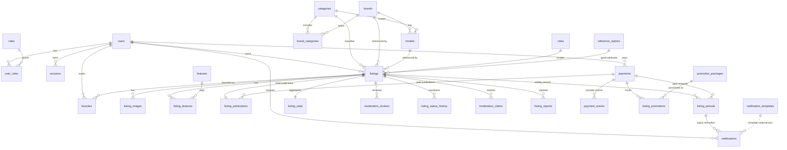

# AVTOSH.AZ — Database Architecture (Phase 4.2)

Date: 2026-08-20
Status: implemented

Migrations in `supabase/migrations/` are the executable source of
truth. This document explains the design; where they disagree, the
migrations win.

## Domains and tables

| Domain | Tables |
| --- | --- |
| Identity | `users`, `roles`, `user_roles`, `otp_challenges`, `sessions` |
| Catalog | `categories`, `brands`, `brand_categories`, `models`, `cities`, `features`, `reference_groups`, `reference_options` |
| Marketplace | `listings`, `listing_images`, `listing_features`, `listing_periods`, `listing_publications`, `favorites`, `listing_stats` |
| Moderation | `moderation_reviews`, `listing_status_history`, `moderation_claims`, `listing_reports` |
| Payments | `payments`, `payment_events` |
| Promotions | `promotion_packages`, `listing_promotions` |
| Notifications | `notification_templates`, `notifications` |
| Governance | `system_settings`, `audit_logs`, `outbox_events` |

## ID strategy

- All major business entities use `uuid` PKs from the built-in
  `gen_random_uuid()` (PostgreSQL 13+; no extension).
- Business user identity is the phone: `users.phone_e164` is
  `UNIQUE NOT NULL` with an E.164 shape CHECK — but **all**
  relationships use `users.id`.
- Listings additionally carry `public_id`, a bigint from
  `listing_public_id_seq` (starting at 10001) for public URLs like
  `/elan/48291`. It is never used as an FK.
- Junction tables (`user_roles`, `brand_categories`,
  `listing_features`, `favorites`) use composite PKs.

## Money strategy

All monetary values are **bigint minor units** (`200` = 2.00 AZN):
`payments.amount_minor`, `listings.price_minor`,
`promotion_packages.price_minor`, promotion/payment snapshots, and
monetary `system_settings` (`value_type = 'money_minor'`). Floating
point is never used. `currency` is a `char(3)` ISO code defaulting to
`'AZN'` (shape-checked, not value-locked, so adding a currency needs
no migration).

## Enum strategy

PostgreSQL enums are used only for stable, tightly controlled
lifecycles — exactly the value sets fixed in CLAUDE.md: listing,
payment, promotion, notification, OTP, report, outbox statuses,
payment/promotion types, channels, actor types. Manageable reference
data (fuel types, colors, body types, ...) lives in
`reference_groups`/`reference_options` rows; roles are a normalized
table. Both can grow without migrations.

## Free publication accounting (critical rule)

`listing_publications` is an immutable history of **initial**
publications only — the source of truth for the lifetime
first-3-free rule. There is deliberately **no**
`users.free_listings_left` column.

- `UNIQUE (listing_id)` — a listing has at most one initial
  publication, so edits, reject/resubmit cycles, and renewals can
  never consume quota.
- `UNIQUE (user_id, publication_number)` — the lifetime ordinal per
  user is race-proof at the database level.
- Rows are never deleted, so deleting a listing never restores quota.
- `billing_type` records FREE vs PAID; `PAID` requires `payment_id`
  (CHECK).

**Allocation contract for future service code:** inside the
publication transaction, take a per-user lock — either
`pg_advisory_xact_lock(hashtextextended(user_id::text, 0))` or
`SELECT id FROM users WHERE id = $1 FOR UPDATE` — then read
`COALESCE(MAX(publication_number), 0) + 1` for the user, compare with
`listing.free_publication_limit` (system setting) to decide
FREE/PAID, and insert. If a concurrent transaction slips through, the
unique constraint rejects it; retry. Never precompute ordinals
outside the transaction.

## Listing periods and expiry

`listing_periods` stores the 30-day publication/renewal history
(`source` = INITIAL | RENEWAL, `UNIQUE (listing_id, period_number)`,
`ends_at > starts_at`). `listings.current_expires_at` remains the
authoritative convenient value: every public query filters
`status = 'ACTIVE' AND current_expires_at > now()`. Renewal keeps the
same listing id and adds a new period row.

## Payment ↔ listing FK cycle

`payments` references `listings`, while `listing_periods` and
`listing_publications` reference `payments`. To avoid a circular
migration dependency, the `payment_id` columns are created in
migration 004 (marketplace) **without** FKs, and the FK constraints
are added in migration 006 (payments) after `payments` exists.
`payments.promotion_package_id` is likewise added in migration 007
after `promotion_packages` exists. Documented here and in the
migration headers.

## Pre-provider payment intents (migration 014)

`payments.provider` is nullable so an internal LISTING_FEE intent can
exist in `CREATED` state before any provider/checkout; `CHECK
(provider IS NOT NULL OR status IN ('CREATED','CANCELLED'))` keeps
every progressed payment bound to a real provider.

## Anonymous action rate limiting (migration 016)

`anonymous_action_events` is a generic window bucket for anonymous
public actions (first user: contact reveal): `action`, `source_hash`
(always a keyed HMAC of the trusted client IP — never raw),
`subject_id`, `created_at`, indexed `(action, source_hash,
created_at)`. Short-lived data; a future job may prune old rows.

## Idempotency foundations

- **Payments**: `idempotency_key UNIQUE` (client/server retry
  safety); `provider_transaction_id UNIQUE` (nullable — enforced when
  present); fulfillment driven only by verified provider events.
- **Payment events (webhooks)**: `UNIQUE (provider,
  provider_event_id)` — replayed webhooks are rejected at insert,
  giving exactly-once processing semantics on top of an audit trail
  (`payload`, `processing_status`, timestamps).
- **Notifications**: `dedupe_key UNIQUE` (e.g.
  `LISTING_EXPIRY_REMINDER:<listing_period_id>:D7`), so reminder
  creation and sending jobs can run repeatedly without duplicates;
  reminders schedule against `listing_period_id`.
- **Promotions**: each purchase is its own immutable
  `listing_promotions` row with purchase-time snapshots; a GiST
  exclusion constraint forbids overlapping SCHEDULED/ACTIVE periods
  of the same type per listing (`[)` bounds let a queued period start
  exactly when the previous ends). PREMIUM and BOOST may coexist.
- **Outbox**: `outbox_events` with `status`/`available_at`/
  `attempt_count` supports at-least-once delivery; consumers must be
  idempotent.

## Audit strategy

`audit_logs` is append-only. A database trigger
(`audit_logs_append_only`) raises on any UPDATE or DELETE, so even
privileged application code cannot mutate history (TRUNCATE is not
trigger-guarded — production DB privileges should also REVOKE
UPDATE/DELETE/TRUNCATE from the runtime role once Supabase role
provisioning is configured). `entity_id` is text so any key type can
be recorded; `request_id` ties entries to API request IDs.

## Deletion strategy

- **RESTRICT** (history/money must survive): everything referencing
  `payments`; `listings` → owner/catalog/city refs;
  `listing_periods`, `listing_publications`, `moderation_reviews`,
  `listing_status_history`, `listing_reports` → listings/users;
  catalog cross-refs (`models` → brands/categories,
  `reference_options` usage, `features` usage).
- **SET NULL** (record survives, actor/reference detaches): audit
  actor, report resolver, status-history actor, notification
  listing/period refs, `system_settings.updated_by`.
- **CASCADE** (genuine owned children only): `sessions`,
  `user_roles`, `favorites`, `listing_images`, `listing_features`,
  `listing_stats`, `moderation_claims`, `brand_categories`.
- Listings are soft-deleted via `status`/`deleted_at`; catalog rows
  are deactivated via `is_active`. No cascade path can delete payment
  or audit history.

## Important indexes (with query justification)

| Index | Query it serves |
| --- | --- |
| `listings_active_search` (category, brand, model, published_at DESC, partial ACTIVE) | public browse/search, newest first |
| `listings_active_price` / `_year` / `_mileage` / `_city` (partial ACTIVE) | search filters/sorts |
| `listings_active_expires_at` (partial ACTIVE) | expiration job |
| `listings_moderation_queue` (submitted_at, partial PENDING_MODERATION) | moderator queue |
| `listings_owner` | "my listings" dashboard |
| `otp_challenges_phone_recent` | phone-level OTP rate limiting |
| `sessions_user`, `sessions_expires_at` | session lookup; stale-session cleanup |
| `payments_user`, `payments_status` | payment history; reconciliation job |
| `payment_events_payment` | webhook history per payment |
| `listing_promotions_type_status_ends` | promotion expiry job, feed lookups |
| `notifications_due` (scheduled_for, partial SCHEDULED) | notification sender job |
| `outbox_events_due` (available_at, partial PENDING) | outbox worker fetch |
| `audit_logs_entity`, `audit_logs_actor` | audit lookups |
| catalog indexes (`models_brand_category`, `reference_options_group`) | pickers/dropdowns |

## ERD (major relationships)

## Validation

`pnpm db:validate` (see `scripts/db/validate.sh`) boots an ephemeral
PostgreSQL 16, applies all migrations from scratch, and runs
`scripts/db/constraint-tests.sql` — 22 negative/positive cases
covering duplicate phone/favorite/role, primary-image uniqueness,
period validity and numbering, webhook and notification dedup,
payment amount/idempotency, publication accounting, promotion
overlap, audit append-only, and catalog uniqueness. The Supabase CLI
local stack (Docker) is not available on the current machine; see
`supabase/README.md`.
